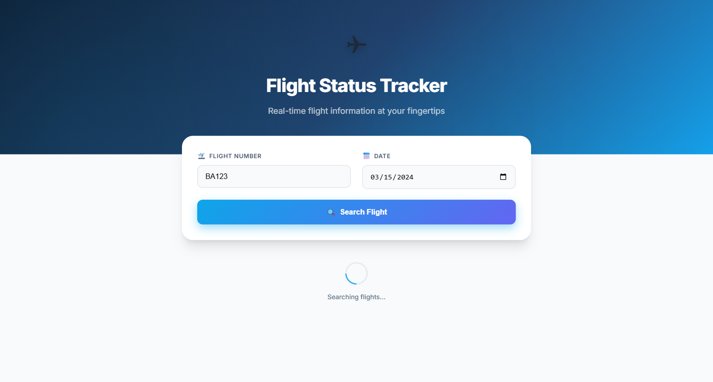
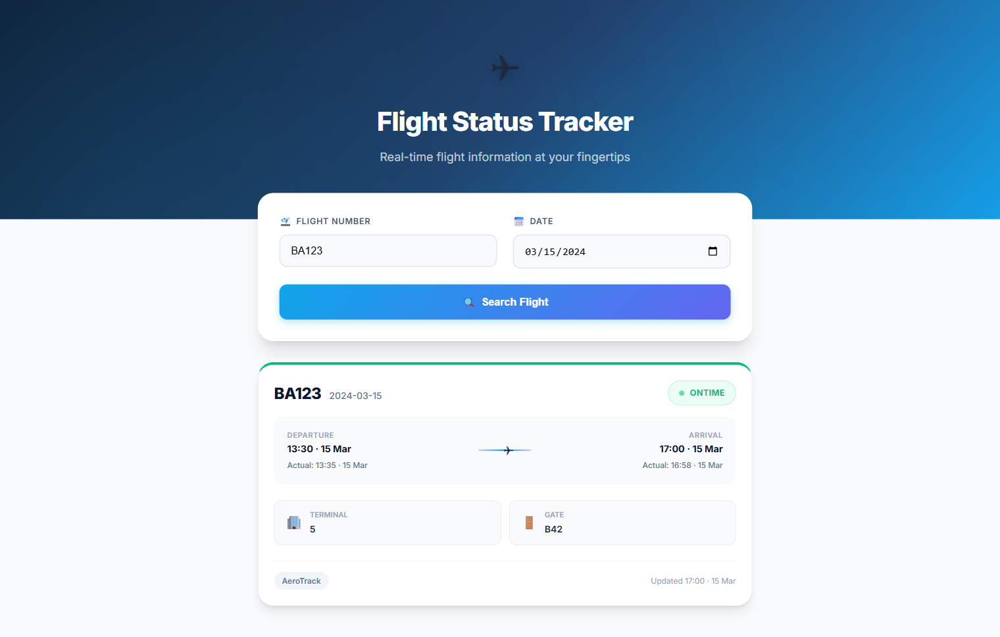

# Flight Status Tracker

A full-stack flight status lookup application built with a .NET 8 Minimal API backend and Angular 21 frontend. Support agents can search for flights by number and date to view consolidated status information sourced from two stub providers (AeroTrack and QuickFlight). The system normalises provider-specific status vocabularies into a unified model and merges results based on data freshness.

Runs fully offline with no external API dependencies — stub providers return deterministic hardcoded data.

## Screenshots

| Landing Page | Loading State | Flight Result |
|:---:|:---:|:---:|
|  |  |  |

## Prerequisites

- [.NET 8 SDK](https://dotnet.microsoft.com/download/dotnet/8.0)
- [Node.js 18+](https://nodejs.org/) and npm
- Angular CLI (optional — available via `npx`)

## Getting Started

Clone the repository and follow the steps below to run the application.

### Backend

```bash
cd FlightStatus.Api
dotnet run
```

The API will be available at **http://localhost:5000**.

### Frontend

```bash
cd flight-status-ui
npm install
npm start
```

The UI will be available at **http://localhost:4200**.

### Running Tests

**Backend tests (xUnit + FsCheck):**

```bash
dotnet test FlightStatus.Tests/FlightStatus.Tests.csproj
```

**Frontend tests (Vitest):**

```bash
cd flight-status-ui
npm test
```

## API Documentation

### GET /flights/status

Look up the consolidated status of a flight.

**Query Parameters:**

| Parameter      | Required | Format       | Description                    |
|---------------|----------|--------------|--------------------------------|
| `flightNumber` | Yes      | string       | Flight number (e.g., `BA123`)  |
| `date`         | Yes      | `yyyy-MM-dd` | Flight date (e.g., `2024-03-15`) |

**Success Response (200):**

```json
{
  "flightNumber": "BA123",
  "date": "2024-03-15",
  "status": "OnTime",
  "scheduledDeparture": "2024-03-15T08:00:00Z",
  "scheduledArrival": "2024-03-15T11:30:00Z",
  "actualDeparture": "2024-03-15T08:05:00Z",
  "actualArrival": "2024-03-15T11:28:00Z",
  "terminal": "5",
  "gate": "B42",
  "delayReason": null,
  "lastUpdatedUtc": "2024-03-15T11:30:00Z",
  "provider": "AeroTrack",
  "message": null
}
```

**Error Response (400):**

```json
{
  "message": "The 'date' parameter must be in yyyy-MM-dd format.",
  "field": "date"
}
```

**Example Requests:**

```bash
# Valid request
curl "http://localhost:5000/flights/status?flightNumber=BA123&date=2024-03-15"

# Missing flight number → 400
curl "http://localhost:5000/flights/status?date=2024-03-15"

# Invalid date format → 400
curl "http://localhost:5000/flights/status?flightNumber=BA123&date=15-03-2024"
```

**Possible Status Values:**

| Status      | Description                                     |
|-------------|-------------------------------------------------|
| `OnTime`    | Flight is on schedule                           |
| `Delayed`   | Departure or arrival pushed beyond 15 minutes   |
| `Cancelled` | Flight will not operate                         |
| `Diverted`  | Flight landed at a different airport            |
| `Unknown`   | No data available or unrecognised status        |

## Project Structure

```
FlightStatus.sln                    — .NET solution file
FlightStatus.Api/                   — .NET 8 Minimal API backend
├── Endpoints/                      — API route handlers and validation
├── Models/                         — Data models, enums, DTOs
├── Providers/                      — Stub flight data providers
├── Services/                       — Business logic (normaliser, merger, service)
└── Program.cs                      — App configuration and DI setup
FlightStatus.Tests/                 — Backend test project
├── Properties/                     — FsCheck property-based tests
├── Unit/                           — xUnit unit and integration tests
└── Generators/                     — FsCheck custom generators
flight-status-ui/                   — Angular 21 frontend
└── src/app/
    ├── components/                 — Standalone Angular components
    │   ├── flight-search/          — Search form with validation
    │   ├── flight-status-card/     — Result display with colour coding
    │   └── error-display/          — Error state display
    ├── models/                     — TypeScript interfaces
    └── services/                   — Angular HTTP service
```

## Available Test Flights

The stub providers include data for the following flights on date **2024-03-15**:

| Flight   | AeroTrack Status | QuickFlight Status | Winning Provider | Unified Status |
|----------|-----------------|-------------------|-----------------|----------------|
| `BA123`  | ON_SCHEDULE     | scheduled          | AeroTrack       | OnTime         |
| `LH456`  | LATE            | delayed            | QuickFlight     | Delayed        |
| `AF789`  | CANCELLED       | cancelled          | QuickFlight     | Cancelled      |
| `EK101`  | REROUTED        | diverted           | AeroTrack       | Diverted       |

The "winning provider" is determined by whichever has the later `lastUpdatedUtc` timestamp.

## Testing

The project uses a multi-layered testing strategy:

**Backend:**

- **Property-based tests** (FsCheck + xUnit) — verify universal correctness properties across generated inputs: date validation, status normalisation, merger selection logic, and result model completeness.
- **Unit tests** (xUnit + FluentAssertions) — test specific examples for normaliser mappings, merger edge cases, and service orchestration.
- **Integration tests** (WebApplicationFactory) — test the full HTTP pipeline including validation, routing, and serialization.

**Frontend:**

- **Component tests** (Vitest) — test rendering, form validation, conditional display, colour coding, loading states, and error handling.
- **Service tests** (Vitest) — verify HTTP calls to the backend API.

## Architecture

The backend follows a layered architecture:

1. **Presentation** — Minimal API endpoint handles HTTP concerns and input validation
2. **Application** — FlightStatusService orchestrates provider calls and delegates to business logic
3. **Domain** — StatusNormaliser and FlightStatusMerger contain pure business logic
4. **Infrastructure** — AeroTrackProvider and QuickFlightProvider supply stub data via `IFlightStatusProvider`

All components are registered via dependency injection, making it straightforward to swap stub providers for real implementations.
